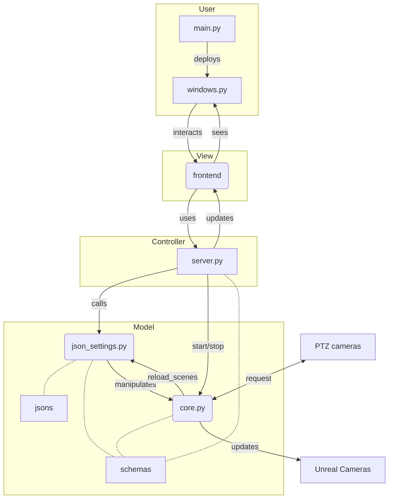
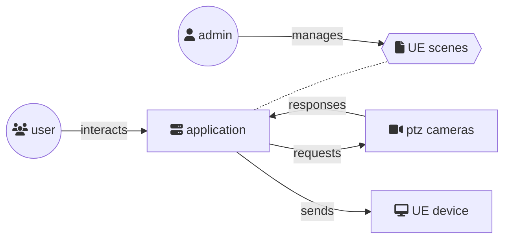

# ptztrack_ue5
Using onvif-based ptz cameras for virtual production in Unreal Engine 5

## Usage

```bash
python3 main.py
```

This is a desktop application, so you can see the interface.

## Install

### For server:
1. download pip packet
2. install packet
```
pip install FILE_NAME
```
2. change environment variables or use .env file
```
# IP and Port http server
IP_ADDR_FASTAPI = "127.0.0.1"
PORT_FASTAPI = 8080
# IP config for Unreal Engine
IP_ADDR_UNREAL_REMOTE_CONTROL = "127.0.0.1"
PORT_UNREAL_REMOTE_CONTROL = 30010
# Onvif variables
WSDL_PATH = "WSDL_ABSOLUTE_PATH"
```
3. run server:
```
ptztrack_ue5
```
4. Got to docs:
```
http://127.0.0.1:8080/docs
```
## Dependencies

To install the dependencies, run:

```bash
pip3 install -r requirements.txt
```

Also, to run, you must have Unreal Engine 5.1 with the Remote Control API installed and the Web Server running on it at 127.0.0.1:30010

## Scenes

The jsons folder that contains json files, the filename is the name of the scene, and the content is the cameras in it. These files can be created using the interface or manually.

# Architecture


# Concept scheme
